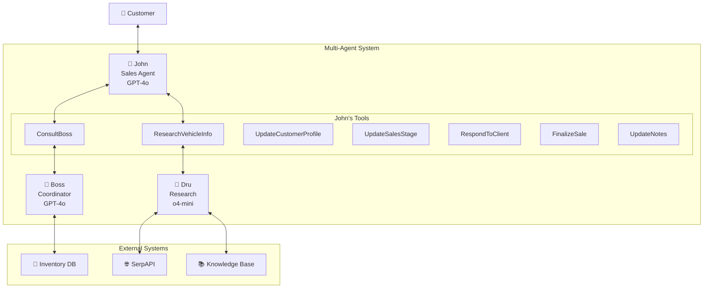

# 🚗 M - Advanced Multi-Agent Car Sales System

[](https://www.python.org/downloads/)
[](https://langchain.com/)
[](https://openai.com/)
[](https://streamlit.io/)
[](https://opensource.org/licenses/MIT)

## 🏆 Powered By

<div align="center">
  <a href="https://streamlit.io" target="_blank">
    
  </a>
  &nbsp;&nbsp;&nbsp;&nbsp;
  <a href="https://langchain.com" target="_blank">
    
  </a>
</div>

> **A sophisticated multi-agent AI system for intelligent car sales, demonstrating advanced agent coordination, real-time research, and professional sales workflows.**

---

## 🎯 Overview

CarBot Pro showcases the cutting-edge capabilities of multi-agent AI systems in a real-world sales scenario. The system coordinates three specialized AI agents to provide a complete, professional car buying experience with intelligent inventory management, real-time research, and advanced negotiation capabilities.

### 🤖 Meet the Agents

| Agent | Model | Role | Specialization |
|-------|-------|------|----------------|
| **🎯 John** | GPT-4o | Sales Expert | Customer interaction, sales process, negotiation |
| **🔬 Dru** | o4-mini | Research Specialist | Vehicle research, technical analysis, market data |
| **🏢 Boss** | GPT-4o | Business Coordinator | Inventory management, pricing, business policies |

## ✨ Key Features

### 🔧 Advanced Capabilities
- **🧠 Intelligent Agent Coordination** - Seamless communication between specialized agents
- **🔍 Smart Inventory Search** - AI-powered vehicle matching with 40+ enriched vehicle database
- **🌐 Real-time Web Research** - Live vehicle information via SerpAPI integration
- **📊 Dynamic Customer Profiling** - Automatic extraction and management of customer preferences
- **💼 Professional Sales Process** - Complete sales funnel from greeting to closing
- **📈 Real-time Analytics** - Comprehensive metrics and conversation analytics
- **🔄 State Management** - Advanced sales stage tracking and progression

### 📋 Sales Process Stages
1. **Greeting** - Initial rapport building
2. **Discovery** - Needs assessment and profiling
3. **Presentation** - Intelligent vehicle recommendations
4. **Objection Handling** - Professional concern resolution
5. **Negotiation** - Policy-based pricing and alternatives
6. **Closing** - Sale finalization with inventory updates
7. **Follow-up** - Post-sale relationship management

### 🚗 Rich Vehicle Database
- **Comprehensive Data**: Make, model, year, color, mileage, price
- **Technical Specs**: Engine, transmission, fuel efficiency, safety ratings
- **Special Features**: Technology packages, interior details, location
- **Price Range**: €25,000 - €320,000 (economy to luxury supercars)

---

## 🚀 Quick Start

### Option 1: Automated Setup (Recommended)

```bash
git clone https://github.com/jomasego/multiagent_sales.git
cd multiagent_sales/car-salesman
python quick_setup_advanced.py
```

### Option 2: Manual Installation

#### Prerequisites
- Python 3.8 or higher
- OpenAI API key (required)
- SerpAPI key (optional, for web research)

#### Installation Steps

1. **Clone the repository**
```bash
git clone https://github.com/jomasego/multiagent_sales.git
cd multiagent_sales/car-salesman
```

2. **Create virtual environment**
```bash
python -m venv .venv

# Activate (Linux/macOS)
source .venv/bin/activate

# Activate (Windows)
.venv\Scripts\activate
```

3. **Install dependencies**
```bash
pip install --upgrade pip
pip install -r requirements.txt
```

4. **Configure environment variables**
```bash
cp config.env .env
# Edit .env with your API keys
```

5. **Set up API keys in `.env`**
```env
# Required: OpenAI API Key
OPENAI_API_KEY=sk-your_openai_key_here

# Optional: SerpAPI Key for web research
SERPAPI_API_KEY=your_serpapi_key_here
```

6. **Run the application**
```bash
streamlit run enhanced_app.py
```

7. **Access the interface**
   - Open your browser to `http://localhost:8501`
   - Configure API keys in the sidebar
   - Click "🚀 Initialize Advanced System"
   - Start chatting with John!

---

## 📖 Usage Examples

### Basic Interaction Flow

```python
# Example conversation flow
customer_input = "I'm looking for a safe family car"

# System processes through multi-agent workflow:
# 1. John updates customer profile
# 2. John consults Boss for inventory options
# 3. Boss searches inventory and provides recommendations
# 4. John presents options to customer
# 5. Customer asks for technical details
# 6. John requests research from Dru
# 7. Dru provides detailed analysis
# 8. John shares processed information with customer
```

### Demo Script Suggestions

#### 1. **Initial Contact**
```
"Hi, I'm looking for a car"
```
*Expected: John greets and builds rapport*

#### 2. **Family Needs**
```
"I need a bigger, safer car because we just had a baby"
```
*Expected: John updates customer profile, shows understanding*

#### 3. **Specific Requirements**
```
"I want a red sedan that's less than 2 years old"
```
*Expected: John consults Boss, searches inventory*

#### 4. **Brand Preference**
```
"I'm interested in BMW vehicles"
```
*Expected: John refines search, presents BMW options*

#### 5. **Technical Inquiry**
```
"What safety features does it have for babies?"
```
*Expected: John requests research from Dru*

#### 6. **Specific Details**
```
"What's the trunk space in the BMW X3?"
```
*Expected: Dru provides technical specifications*

#### 7. **Pricing**
```
"What's the price of the black BMW X3?"
```
*Expected: John consults Boss for official pricing*

#### 8. **Negotiation**
```
"Can you offer any discount?"
```
*Expected: Boss evaluates policies, John negotiates*

#### 9. **Purchase Decision**
```
"I'll take it"
```
*Expected: John finalizes sale, updates inventory*

---

## 🏗️ Architecture

### System Components



---

## 🛠️ Technical Stack

### Core Technologies
- **🤖 AI Models**: OpenAI GPT-4o, o4-mini
- **🔗 Agent Framework**: LangChain
- **🖥️ Frontend**: Streamlit
- **📊 Data Processing**: Pandas, NumPy
- **📈 Visualization**: Plotly
- **🔍 Web Search**: SerpAPI
- **🐍 Language**: Python 3.8+

### Key Dependencies
```
langchain>=0.3.25
langchain-openai>=0.3.18
langchain-community>=0.3.24
streamlit>=1.45.1
pandas>=2.2.3
plotly>=5.17.0
openai>=1.82.0
python-dotenv>=1.1.0
```

---

## 📁 Project Structure

```
carbot-pro/
├── 📄 README.md                          # This file
├── 🚀 quick_setup_advanced.py            # Automated setup script
├── 🎯 advanced_multi_agent_system.py     # Core multi-agent system
├── 📦 enhanced_inventory_manager.py      # Inventory management
├── 🖥️ enhanced_app.py                    # Streamlit interface
├── 🧪 test_system.py                     # System tests
├── 📋 requirements.txt                   # Python dependencies
├── ⚙️ config.env                         # Environment template
├── 📊 data/                              # Vehicle database
└── 📝 carbot_system.log                  # System logs
```

---

## 🔧 Configuration

### Environment Variables

| Variable | Required | Description |
|----------|----------|-------------|
| `OPENAI_API_KEY` | ✅ Yes | OpenAI API key for GPT-4o and o4-mini |
| `SERPAPI_API_KEY` | ❌ Optional | SerpAPI key for web research (fallback to knowledge base) |

### Agent Configuration

Each agent can be customized with different parameters:

```python
# John (Sales Agent)
john_llm = ChatOpenAI(
    temperature=0.8,      # Creative for sales
    model_name="gpt-4o",  # Latest GPT-4o
    max_tokens=1000
)

# Dru (Research Agent)
dru_llm = ChatOpenAI(
    temperature=1,        # Factual for research
    model_name="o4-mini", # Efficient for analysis
    max_tokens=800
)

# Boss (Coordinator)
boss_llm = ChatOpenAI(
    temperature=0.4,      # Balanced for decisions
    model_name="gpt-4o",  # Strategic thinking
    max_tokens=600
)
```

---

## 📊 Analytics & Monitoring

### Available Metrics
- **Conversation Analytics**: Interaction count, agent communications
- **Sales Performance**: Stage progression, conversion tracking
- **Customer Profiling**: Profile completeness, preference analysis
- **Agent Efficiency**: Response times, tool usage patterns

### Logging System
The system provides comprehensive logging:
- **Agent Actions**: All agent decisions and tool usage
- **Inter-Agent Communications**: Message flow between agents
- **Customer Interactions**: Complete conversation history
- **System Events**: Inventory updates, errors, performance metrics

---

## 🧪 Testing

Run the test suite to verify system functionality:

```bash
python test_system.py
```

The test suite covers:
- ✅ Agent initialization
- ✅ Tool functionality
- ✅ Inventory operations
- ✅ Customer profile management
- ✅ Sales stage transitions

---

## 🤝 Contributing

We welcome contributions! Here's how you can help:

### Areas for Contribution
- 🔧 **New Agent Tools**: Expand John's capabilities
- 🌐 **Additional Research Sources**: Integrate more data providers
- 📊 **Enhanced Analytics**: Advanced metrics and visualizations
- 🎨 **UI Improvements**: Better Streamlit interface
- 🧪 **Testing**: Expand test coverage
- 📚 **Documentation**: Improve guides and examples

### Development Setup
1. Fork the repository
2. Create a feature branch: `git checkout -b feature/amazing-feature`
3. Make your changes
4. Add tests for new functionality
5. Commit your changes: `git commit -m 'Add amazing feature'`
6. Push to the branch: `git push origin feature/amazing-feature`
7. Open a Pull Request

---

## 📄 License

This project is licensed under the MIT License - see the [LICENSE](LICENSE) file for details.

**⭐ If you find this project useful, please consider giving it a star on GitHub!**

*Built with ❤️ for the AI community*
